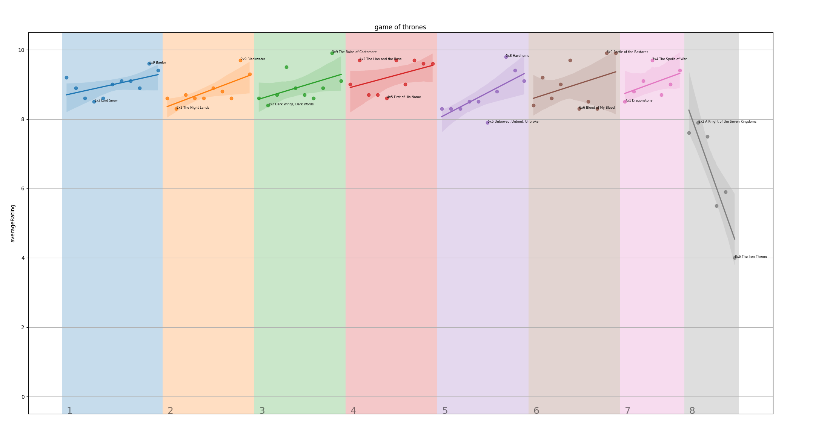

# IMDb Ratings viualizer

This set of scripts allows to visualize the IMDb ratings of a TV series over time.

## Usage

1. Download the IMDb dataset
```
    python download.py
```
2. Generate a graph for a chosen TV series
```
    python main.py "TV series name"
```

# Example

```
    python main.py "Game of Thrones"
```

